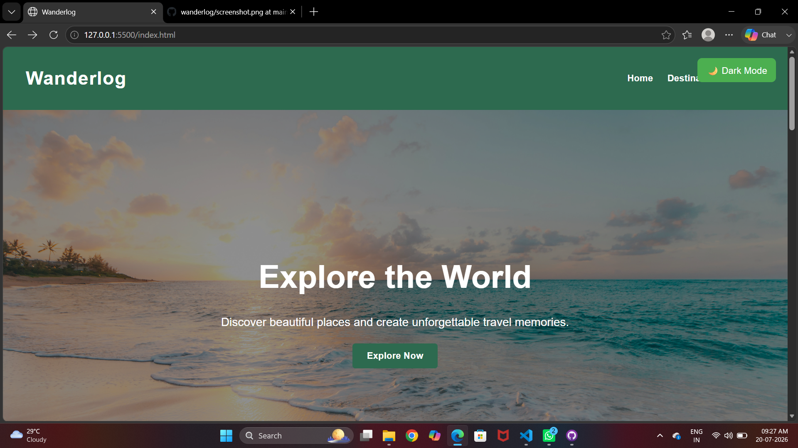
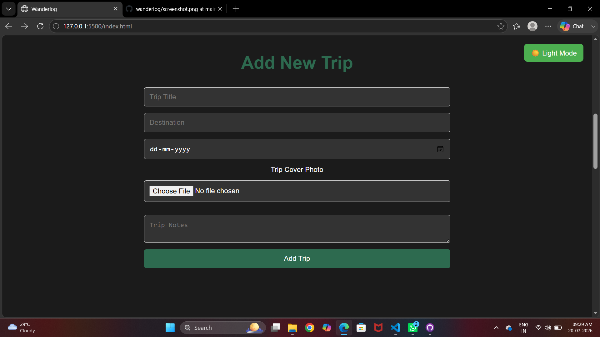
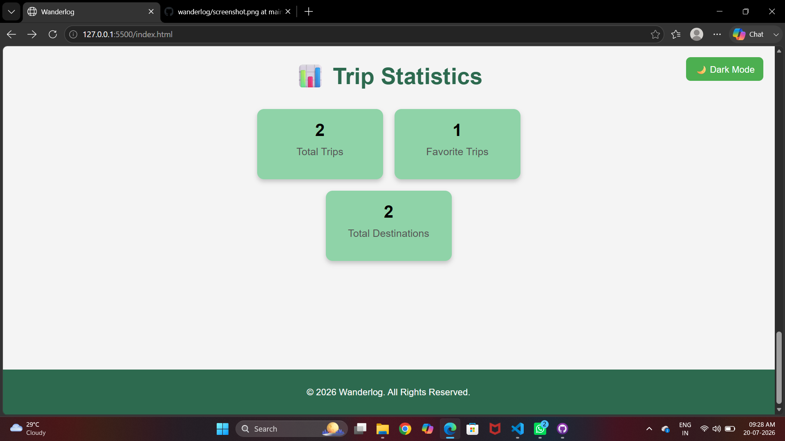
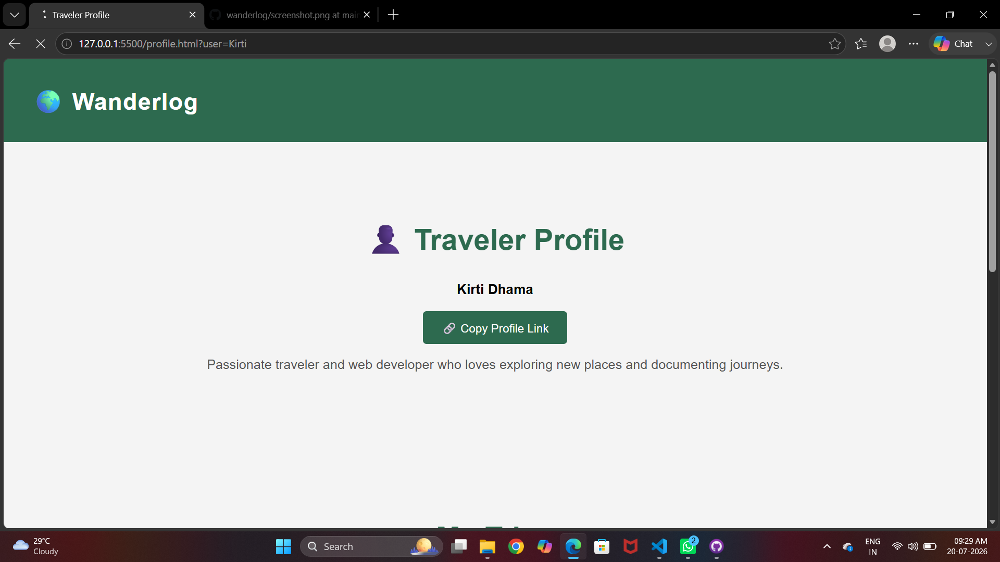

# 🌍 WanderLog

A simple and interactive travel planner built using HTML, CSS, and JavaScript.

## 🚀 Features

- ➕ Add New Trip
- ✏️ Edit Trip
- 🗑️ Delete Trip
- 🔍 Search Trips
- 📅 Filter Trips by Date
- ⭐ Favorite Trips
- 📊 Trip Statistics
- 👤 Traveler Profile
- 🔗 Share Profile Link
- 🌙 Dark Mode
- 📱 Responsive Design
- 🖼️ Image Upload with Base64 Storage
- 💾 Local Storage Support

## 🛠️ Technologies Used

- HTML5
- CSS3
- JavaScript
- Local Storage

## 📷 Screenshots
## Home Page

## Add-Card and Dark Mode

## Statistics

## Profile

## 👩‍💻 Author

Kirti Dhama
