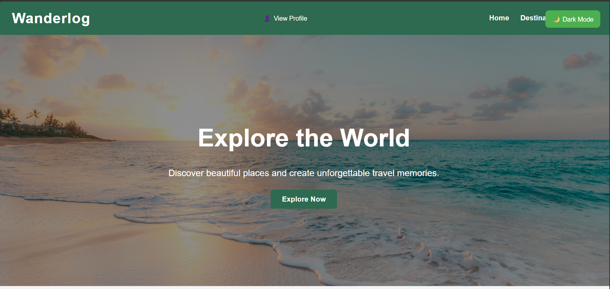
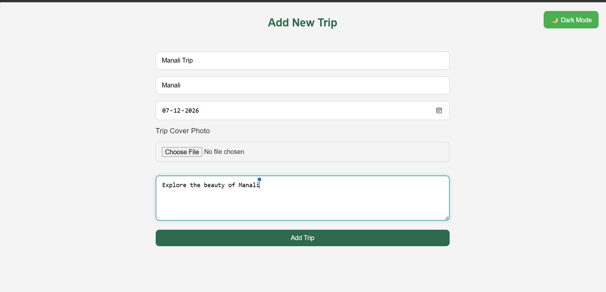
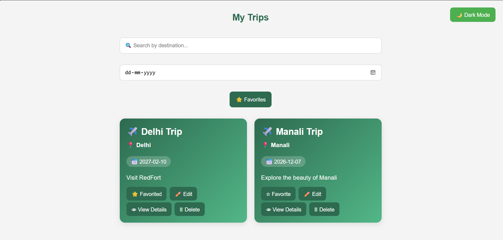
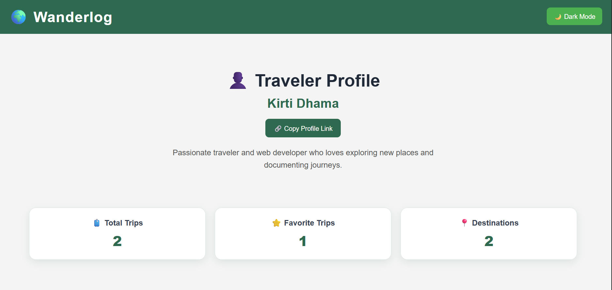
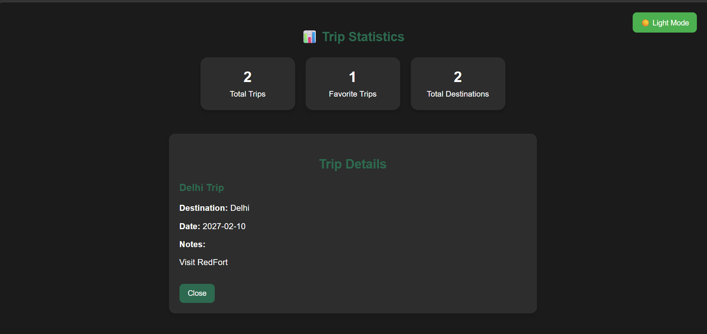

# ✈️ Wanderlog - Trip Planner Web Application

Wanderlog is a full-stack Trip Planner web application that allows users to manage and organize their travel plans.

Users can add trips, edit trip details, delete trips, mark trips as favorites, search and filter trips, upload trip images, and view trip statistics.

---

## 🌐 Live Demo

- **Frontend (Live Website):** https://kirtidhama0613.github.io/wanderlog/
- **Backend API:** https://wanderlog-1sta.onrender.com
- **Health Check:** https://wanderlog-1sta.onrender.com/api/health

  
## 🚀 Features

- ➕ Add new trips
- ✏️ Edit existing trips
- 🗑️ Delete trips
- ⭐ Mark trips as favorites
- 🔍 Search trips
- 📅 Filter trips by date
- ⭐ Filter favorite trips
- 🖼️ Upload trip images
- 👁️ View complete trip details
- 📊 Trip statistics
- 🌙 Dark mode
- 👤 User profile page
- 💾 Persistent data storage using SQLite
- 🔗 Frontend and backend API integration

---

## 🛠️ Technologies Used

### Frontend
- HTML5
- CSS3
- JavaScript

### Backend
- Python
- Flask
- Flask-CORS

### Database
- SQLite

### Tools
- VS Code
- Git
- GitHub

---

## 📂 Project Structure

```text
wanderlog-fullstack/
│
├── backend/
│   ├── app.py
│   └── wanderlog.db
│
├── screenshots/
│
├── index.html
├── style.css
├── script.js
│
├── profile.html
├── profile.css
├── profile.js
│
├── README.md
└── .gitignore

## 📸 Screenshots

### 🏠 Home Page



---

### ➕ Add Trip



---

### 🧳 Trips



---

### 👤 Profile Page



---

### 🌙 Dark Mode




