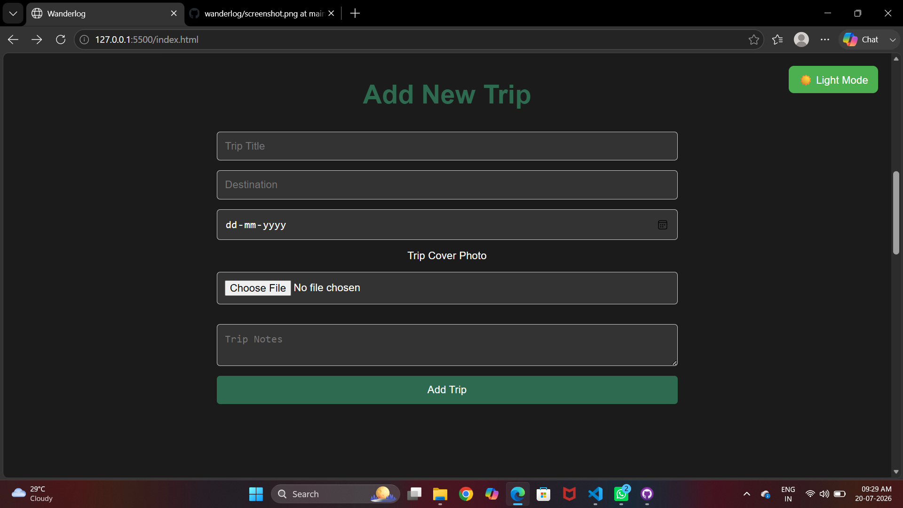
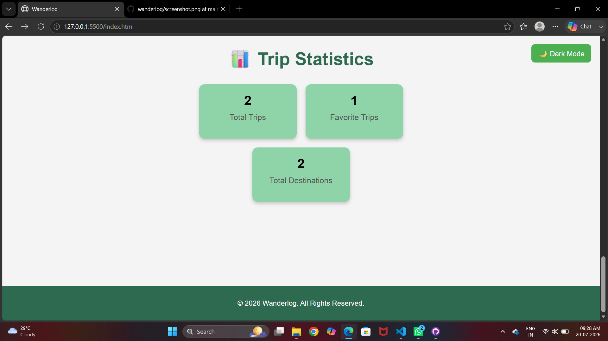

# 🌍 Wanderlog

Wanderlog is a travel planning and trip management web application where users can create, manage, search, filter and save their travel memories.

## ✨ Features

- ➕ Add new trips
- ✏️ Edit existing trips
- 🗑️ Delete trips
- ⭐ Mark trips as favorites
- 🔍 Search trips
- 📅 Filter trips by date
- ⭐ Filter favorite trips
- 👁️ View trip details
- 🖼️ Upload trip cover photos
- 📝 Add trip notes
- 📊 Trip statistics dashboard
- 👤 Traveler profile
- 🔗 Copy profile link
- 🌙 Dark / Light mode
- 📱 Responsive mobile design

## 🛠️ Technologies Used

### Frontend
- HTML
- CSS
- JavaScript


## 📷 Screenshots
## Home Page


## Add-Card and Dark Mode


## Statistics


## Profile


## 👩‍💻 Author

Kirti Dhama

### Backend
- Python
- Flask
- Flask-CORS

### Database
- SQLite

## 📂 Project Structure

```text
Wanderlog/
│
├── index.html
├── profile.html
├── style.css
├── profile.css
├── script.js
├── profile.js
├── app.py
├── wanderlog.db
└── README.md
(Update Wanderlog full stack project)
